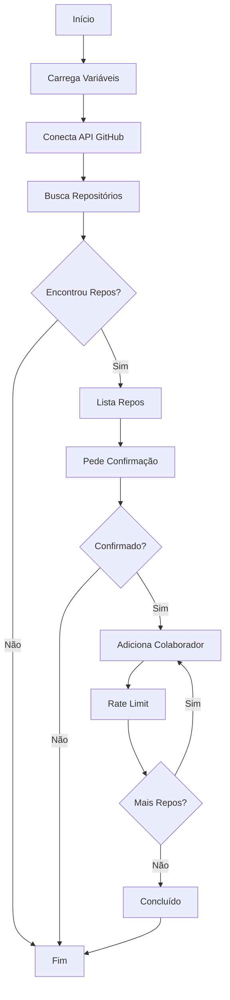

# 🔑 GitHub Bulk Permissions Manager

> Uma ferramenta em Python para gerenciar permissões em massa para repositórios do GitHub dentro de uma organização.

<div align="center">


</div>

## 🚀 Funcionalidades

- ✨ Busca repositórios por prefixo em uma organização
- 👥 Adiciona colaboradores em massa com permissões específicas
- 🔐 Suporte a diferentes níveis de permissão
- 💻 Interface de linha de comando interativa
- 🛡️ Confirmação de segurança antes de aplicar alterações

## ✅ Pré-requisitos

- Python 3.8+
- Token de acesso pessoal do GitHub com permissões apropriadas
- Acesso de administrador à organização do GitHub

## 🔧 Instalação

1. Clone o repositório:
   ```bash
   git clone https://github.com/seu-usuario/git-bulk-actions.git
   cd git-bulk-actions
   ```

2. Crie e ative um ambiente virtual:
   ```bash
   # Unix/macOS
   python -m venv venv
   source venv/bin/activate

   # Windows
   python -m venv venv
   .\venv\Scripts\activate
   ```

3. Instale as dependências:
   ```bash
   pip install -r requirements.txt
   ```

4. Configure as variáveis de ambiente:
   ```bash
   cp production.env.example production.env
   ```

## ⚙️ Configuração

1. Edite o arquivo `production.env` com suas configurações:
   ```env
   GITHUB_TOKEN="seu_token_do_github"
   GITHUB_ORG="sua_organizacao"
   REPO_PREFIX="prefixo_dos_repos"
   COLLABORATOR_USERNAME="usuario_a_ser_adicionado"
   ```

> ⚠️ **IMPORTANTE**:
> - Nunca compartilhe ou comite seu token do GitHub
> - O arquivo `production.env` está no `.gitignore` por segurança
> - Gere um token com as permissões necessárias em: GitHub Settings > Developer Settings > Personal Access Tokens

## 📝 Uso

Execute o script:
```bash
python add-user.py
```

O script irá:
1. Carregar as configurações do ambiente
2. Listar todos os repositórios encontrados com o prefixo especificado
3. Solicitar confirmação antes de adicionar o colaborador
4. Adicionar o colaborador a cada repositório com a permissão "maintain"

## 🔑 Níveis de Permissão

| Nível | Descrição |
|-------|-----------|
| `pull` | Acesso somente leitura |
| `push` | Acesso de leitura e escrita |
| `admin` | Acesso administrativo completo |
| `maintain` | Acesso de gerenciamento sem configurações sensíveis |
| `triage` | Acesso de gerenciamento somente leitura |

## 📊 Fluxo de Execução



## 🔒 Notas de Segurança

<details>
<summary>Clique para expandir</summary>

- Sempre revise os repositórios listados antes de confirmar
- Use tokens com o mínimo de permissões necessárias
- Mantenha seus tokens seguros e nunca os compartilhe
- Revogue tokens comprometidos imediatamente

</details>

## 🐛 Resolução de Problemas

<details>
<summary>Problemas Comuns</summary>

Se encontrar erro "No module named 'requests'":
```bash
pip install -r requirements.txt
```

Problemas de permissão:
1. Verifique se o token tem as permissões necessárias
2. Confirme se você é administrador da organização
3. Verifique se o token não expirou

</details>

## 🤝 Contribuindo

Contribuições são bem-vindas! Por favor:

1. Faça um Fork do projeto
2. Crie uma Branch para sua Feature (`git checkout -b feature/AmazingFeature`)
3. Commit suas mudanças (`git commit -m 'Add some AmazingFeature'`)
4. Push para a Branch (`git push origin feature/AmazingFeature`)
5. Abra um Pull Request

## 📜 Licença

Este projeto está sob a licença MIT. Veja o arquivo [LICENSE](LICENSE) para mais detalhes.

## 📞 Suporte

Para reportar bugs ou solicitar funcionalidades, por favor [abra uma issue](https://github.com/seu-usuario/git-bulk-actions/issues) no GitHub.

---
<div align="center">
Feito com ❤️ para a comunidade GitHub
</div>
